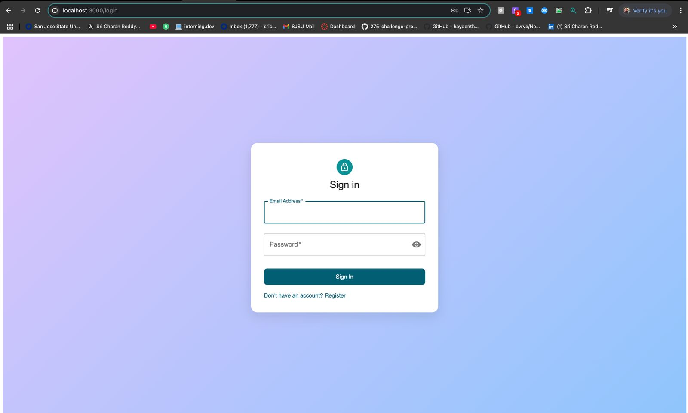
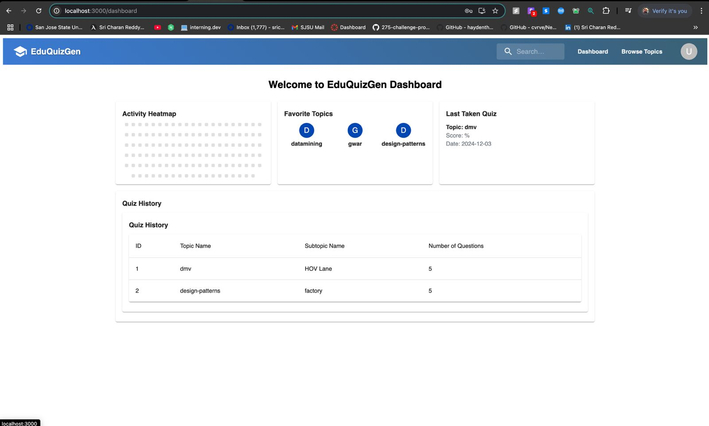
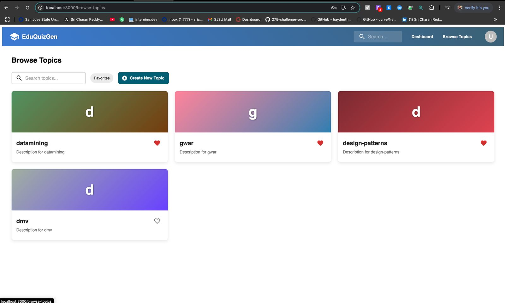
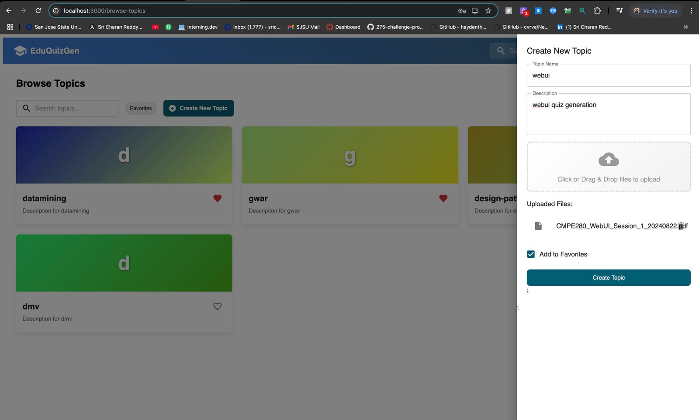
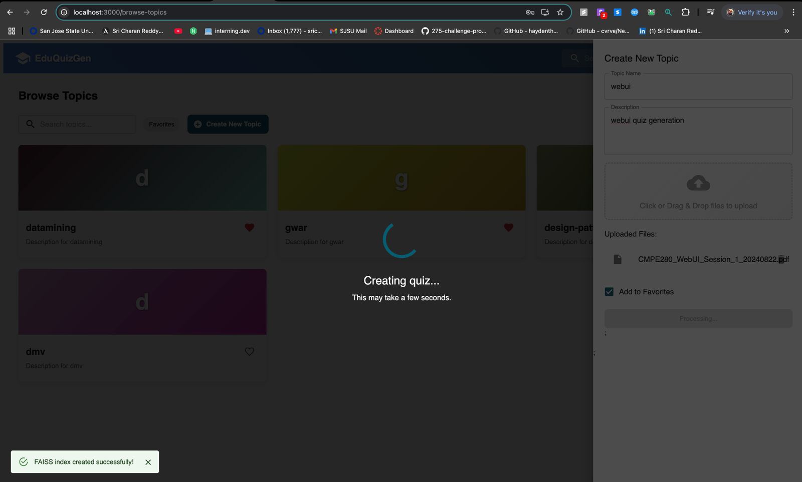
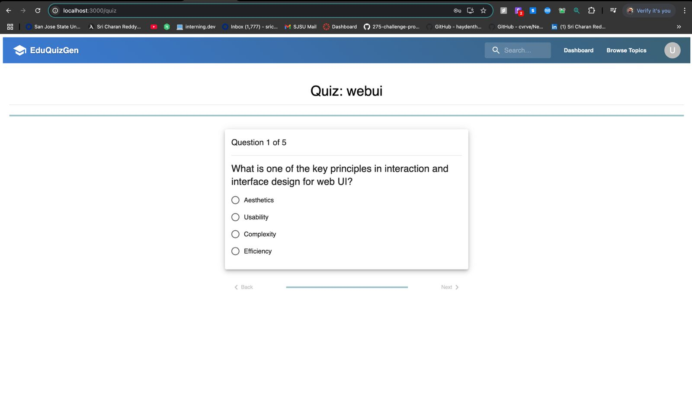
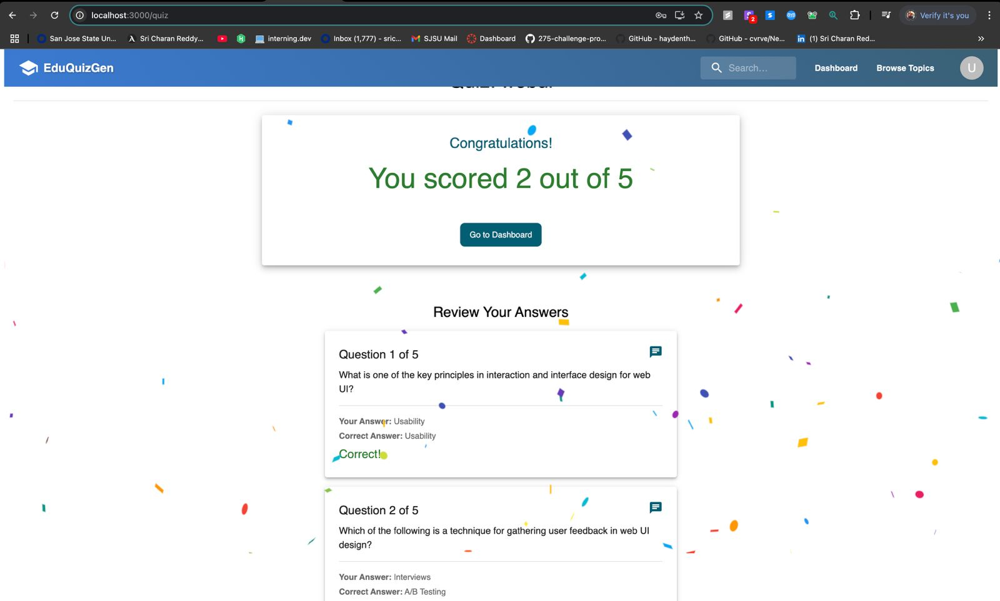

## Contributors

### Sri Charan Reddy Mallu (017419779)

- Designed and implemented the API layer using FastAPI for seamless interaction between the frontend and backend.
- Integrated AWS S3 with the application, enabling dynamic topic management, including listing existing topics and creating new ones.
- Enhanced the question generation module by integrating backend services with GPT-3, ensuring accurate and context-aware quiz questions.

### Siva Vardhineedi (016835312)

- Developed the Retrieval Component using FAISS for efficient vector search, ensuring rapid access to relevant information from the knowledge base.
- Worked on indexing and embedding documents into a vector database, optimizing retrieval for competitive exam topics.
- Fine-tuned the retrieval pipeline to minimize latency and maximize the accuracy of the information provided to the generator module.

### Mahek Virani (017446936)

- Built the frontend using Streamlit, providing a user-friendly interface for topic selection and quiz interaction.
- Implemented the quiz interface with dynamic feedback mechanisms, displaying scores and tracking user progress.
- Collaborated on the integration of frontend components with backend APIs, ensuring a cohesive and responsive user experience.

**Overview of the Quiz Application with RAG Architecture**

The quiz application with RAG architecture is designed to help students prepare for competitive exams. It will consist of two main components:
1. **Retrieval Component**: This will fetch relevant information from a knowledge base (e.g., a database or document store) to provide accurate and up-to-date information.
2. **Generation Component**: This will generate quiz questions and answers using the retrieved information, allowing for more nuanced and context-aware quizzes.

**System Architecture**

1. **Frontend**: A user interface that displays questions, takes answers, and shows scores. This could be implemented with a simple web framework like Streamlit.
    - **Screen 1: Topic Selection**: This screen allows students to select a previous topic or create a new topic. The topics are stored in an S3 bucket at the URI `s3://202-docs/`. The application will list all folder names in the S3 bucket as available topics, and students can also create a new folder (topic) in the S3 bucket.
    - **Screen 2: Quiz Interface**: After selecting or creating a topic, the student moves to the quiz screen where they can answer generated questions.

2. **Backend**: The core logic of the quiz application, which includes the following modules:
    - **Retriever Module**: Retrieves relevant documents or information from a knowledge base using tools like ElasticSearch, FAISS, or other vector databases.
    - **Generator Module**: Uses a large language model (LLM) like GPT-3 or similar to generate questions based on the retrieved content.
    - **Knowledge Base**: This could be a document store containing various topics, which could be domain-specific or general knowledge. Technologies like Pinecone or a local document store can be used.

3. **RAG Integration**: Combines the retriever and generator, meaning the retriever first narrows down the knowledge set, and the generator then uses this set to create the quiz questions.

**Step-by-Step Implementation Plan**

### 1. Setting Up the Knowledge Base
The knowledge base can be created from curated text documents, Wikipedia dumps, or domain-specific documents (like scientific articles, educational materials, etc.). This will be indexed for efficient searching using a vector database such as FAISS or Pinecone, which allows for similarity searches.

- **Data Collection**: Gather data and store it in a document database like MongoDB or use text files. Focus on topics relevant to competitive exams, such as mathematics, science, history, and general knowledge.
- **Indexing**: Use FAISS to create vector embeddings of the documents, allowing the retriever to find relevant documents based on a query.

### 2. Retriever Module
The retriever is responsible for finding relevant content from the knowledge base that is likely to answer a given question.

- **Document Embedding**: Use an embedding model (e.g., Sentence Transformers) to convert documents into vectors.
- **Similarity Search**: Given a query, the retriever will perform similarity search on the vector database and return the top relevant documents.

### 3. Generator Module
The generator uses a large language model to generate questions and possible answers. The RAG model takes both the user query and the relevant retrieved documents to create accurate and context-aware responses.

- **Question Generation**: Use a pre-trained language model like GPT-3. Fine-tune the model if needed, depending on the specificity of the domain. The generator will take input from the retriever, which helps in contextualizing the question.

- **Answer Verification**: After generating questions, generate correct answers based on the same context to ensure the questions are valid.

### 4. RAG Workflow
- **Input**: The user requests a quiz on a specific topic (e.g., "Mathematics for Competitive Exams").
- **Retrieval**: The retriever finds relevant content from the knowledge base related to the chosen topic.
- **Generation**: The generator creates questions based on the retrieved content and provides multiple-choice answers.
- **User Interaction**: The frontend presents the quiz to the user, collects answers, and displays results.

### 5. Frontend Development
The frontend can be a simple Streamlit application that interacts with the backend through RESTful APIs or GraphQL.
- **Screen 1: Topic Selection**: This screen allows the student to select from previous topics or create a new topic. The list of topics is fetched from the S3 bucket (`s3://202-docs/`), where each folder represents a topic. The user can also create a new topic, which will create a new folder in the S3 bucket.
    - **Display Existing Topics**: Use the AWS SDK (Boto3) to list folder names in the S3 bucket.
    - **Create New Topic**: Allow the user to input a new topic name, which will create a corresponding folder in the S3 bucket.
- **Screen 2: Quiz Interface**: Display the questions and provide options for users to select an answer.
    - **Score Calculation**: After each question, the backend calculates the score and provides feedback to the user.
    - **Progress Tracking**: Track the user's progress and show areas of strength and weakness to help with targeted exam preparation.

### 6. Connecting Everything
- **API Layer**: Build an API using a framework like Flask or FastAPI to handle requests between the frontend and backend. This API will provide endpoints for starting a quiz, retrieving questions, and submitting answers.

**Technology Stack**:
- **Frontend**: Streamlit
- **Backend**: Python with FastAPI or Flask
- **Database**: MongoDB for document storage, FAISS or Pinecone for vector indexing
- **LLM**: GPT-3 (OpenAI API) or a similar generative model
- **Storage**: AWS S3 for topic storage

**Example Flow**:
1. **User Request**: The user requests a quiz on "World History."
### Login

2. **Retrieve Content**: The retriever fetches relevant content from the knowledge base about world history.

3. **Generate Quiz**: The generator creates questions like, "Who was the first emperor of China?" based on the retrieved content.

4. **User Interaction**: The user answers, and the system provides immediate feedback and updates the score.

